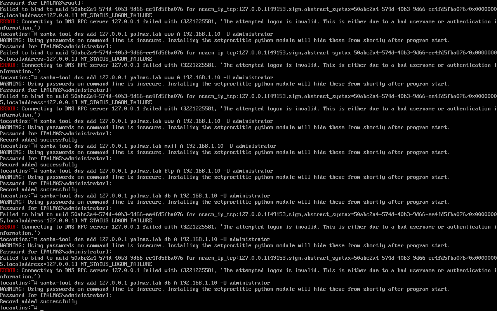
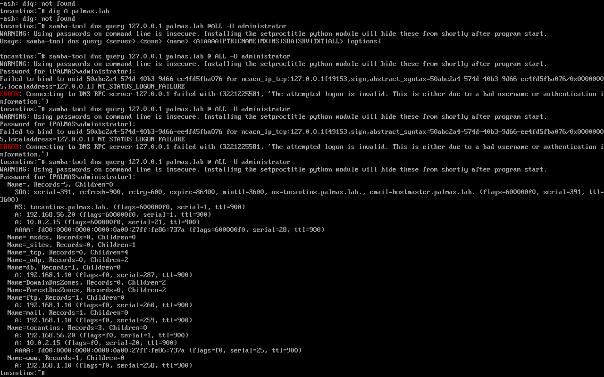
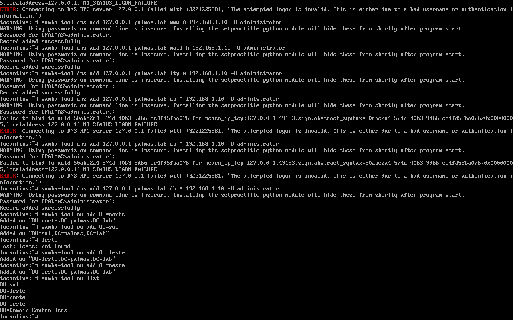

# Registros de Recurso do DNS

Pontuação: 30 pontos
 
Usando comando `samba-tool`, crie 4 registros do DNS do tipo A (Vide Planilha passada no GSA)

Use o seguinte comando para listar todos os registros de sua zona:

- `samba-tool dns query 127.0.0.1 "<estado>.lab" @ ALL -U administrator`

## Para criar registros DNS do tipo A usando o 'samba-tool', siga o formato abaixo. Onde cada registro A mapeia um nome de domínio para um endereço IP.

### Sintaxe do comando 'samba-tool' para adicionar registros do tipo A:

`samba-tool dns add <servidor-dns> <domínio> <nome-registro> A <endereço-ip>` 

- **<servidor_dns>**: O endereço IP do servidor DNS Samba (geralmente **127.0.0.1** se o servidor DNS estiver rodando localmente).

- **<domínio>**: O domínio ao qual você está adicionando os registros (por exemplo, **palmas.lab**).

- **<nome_registro>**: O nome que você deseja associar ao endereço IP.

- **A**: Define o tipo do registro como um registro A.

- **<endereço-ip>**: O endereço IP correspondente ao nome de domínio.

### Exemplo hipotético: Criando 4 registros do protocolo DNS do tipo 
### **A**:

1. **Registro para** www.palmas.lab:

`samba-tool dns add 127.0.0.1 plamas.lab www A 192.168.1.10`

2. **Registro para** mail.palmas.lab: 

`samba-tool dns add 127.0.0.1 palmas.lab mail A 192.168.1.11`

3. **Registro para** ftp.palmas.lab: 

`samba-tool dns add 127.0.0.1 palmas.lab ftp A 192.168.1.12`

4. **Registro para** db.palmas.lab:

`samba-tool dns add 127.0.0.1 palmas.lab db A 192.168.1.13`

### Explicação: 

* www.palmas.lab será resolvido para **192.168.1.10**

* **mail.palmas.lab** será resolvido para **192.168.1.11**

* **ftp.palmas.lab** será resolvido para **192.168.1.12**

* **db.palmas.lab** será resolvido para **192.168.1.13**

### Verifique os registros.

para garantir que os registros foram criados corretamente, você pode usar o comando para listar os registros DNS:

`samba-tool dns query 127.0.0.1 palmas.lab @ ALL`

Esse comando listará tosos os registros do protocolo DNS do domínio **palmas.lab**, incluindo os novos registros **A**.

### Criar a Unidade Organizacional (OU)

As OUs ajudam a organizar entradas dentro de uma estrutura hierárquica e podem ser usadas para aplicar políticas específicas a grupos de objetos.

