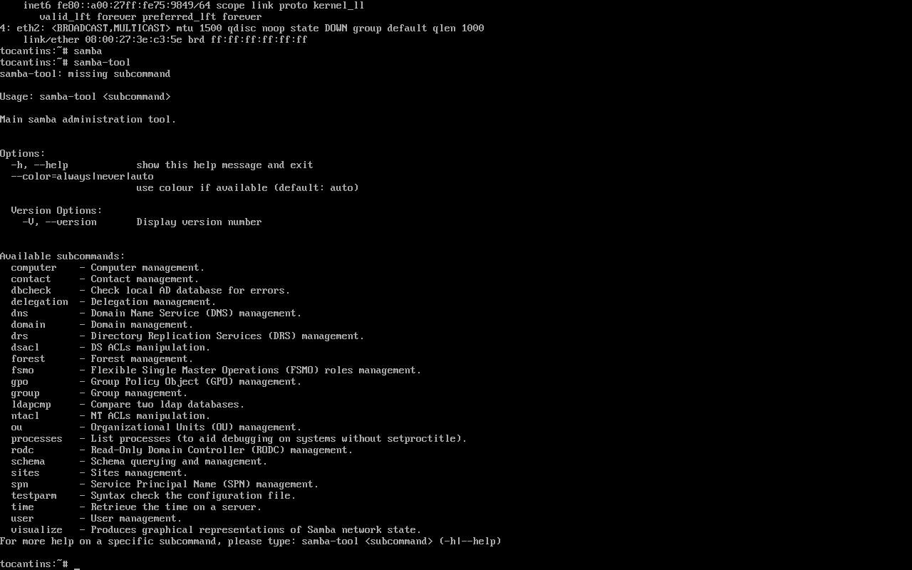
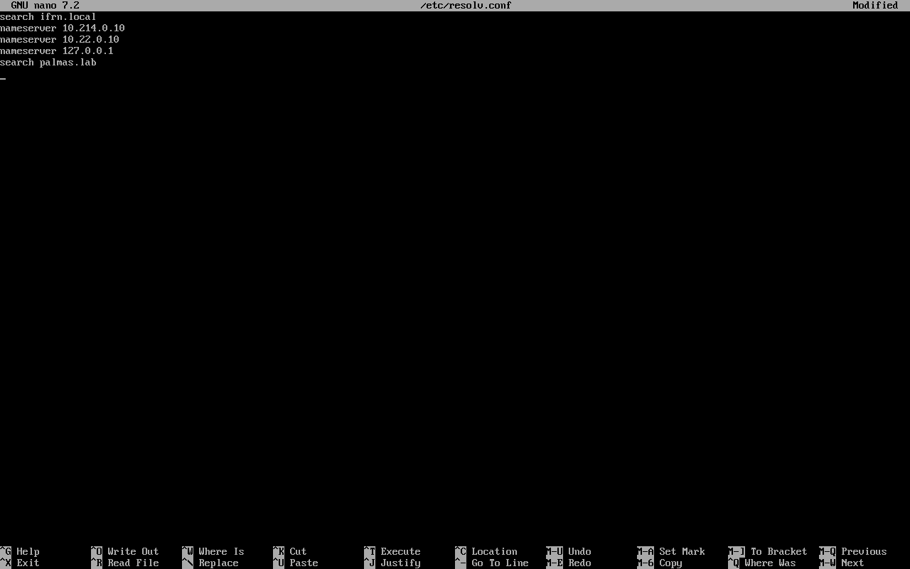
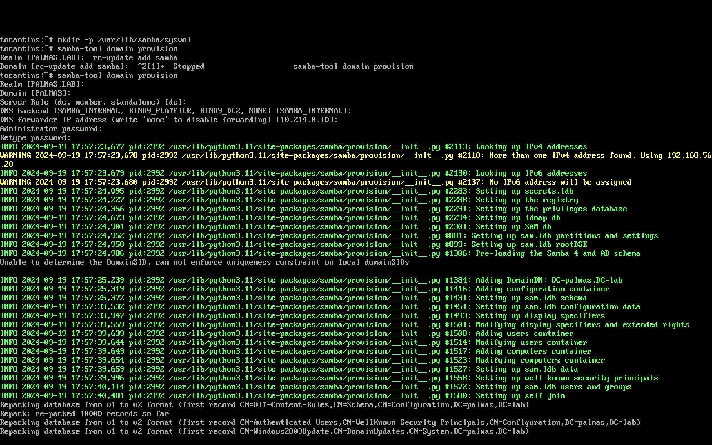
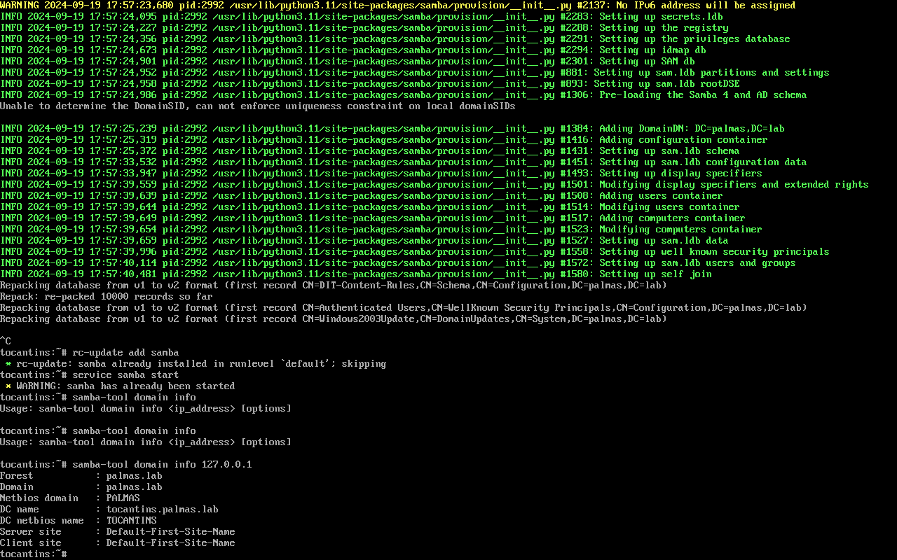
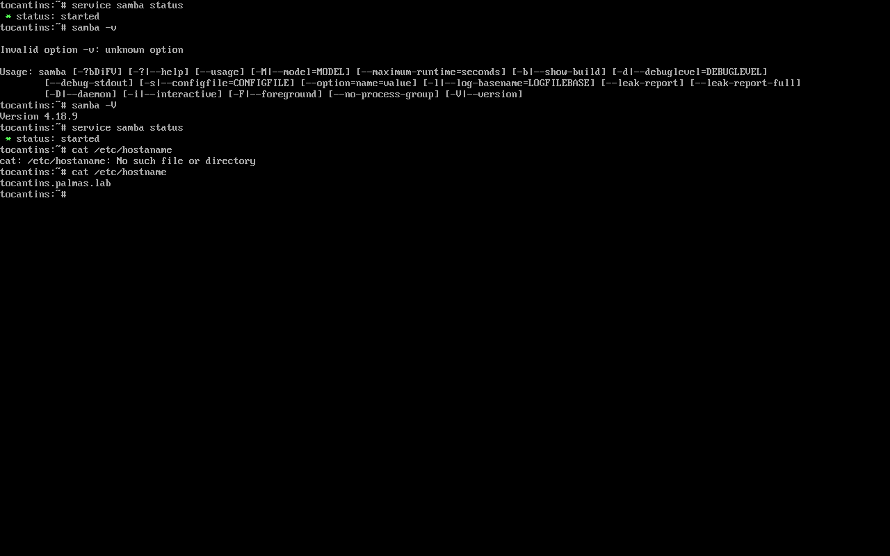

# Instalação do SAMBA

Pontuação: [30 pontos]

!!! note "Observações"

    1. Documentação é texto mais texto e menos imagens.
    2. Senti falta do tutorial da instalação (Configuração do nome da máquina, arquivo `/etc/samba/smb.conf` e outros passos da instalação)

Documente a instalação do Samba no Alpine Linux

Dica: 

1. Use o [aplicativo ChatGPT do Celular](https://play.google.com/store/apps/details?id=com.openai.chatgpt&hl=pt_BR)
2. Copie a resposta (Formato Markdown)
3. Cole em uma conversa do WhatsApp com seu colega de grupo
4. Abra o [WhatsApp Web](https://web.whatsapp.com/) em um PC/Notebook
5. Copie o conteúdo da conversa, que deve estar no formato Markdown, e cole em sua documentação.

!!! note "Dica de *prompt* para o [ChatGPT](https://chatgpt.com)" 

- Como instalar um servidor Samba como contraldor de domínio do ActiveDirectory. O sistema operacional é o Alpine Linux. O domínio "<estado>.lab".
### Instalaçao
Atualize seu sistema `apk update && apk upgrade` Instale o Samba-tool
`apk add samba samba-tools` Inicie o serviço samba  `rc-update add samba default ``service samba start`

### Conferindo se esta Instaldo samba-tool

O comando samba domain level show é uma ferramenta útil para administradores de sistemas que gerenciam ambientes Samba como controladores de domínio, ajudando a verificar e entender a configuração atual do domínio.

### Definir Servidores DNS e Configurar Domínios de Pesquisa

### Criand Dominio
 

